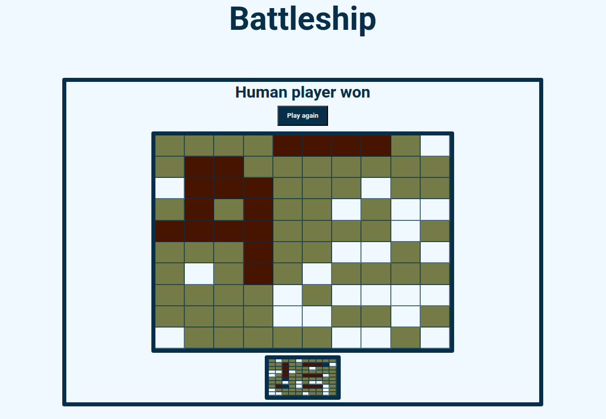

# Battleship
Live demo &#128073; https://masecurity.github.io/Battleship/
## What is this project about?

<br>
This project is a digital implementation of the classic Battleship game, where a human player competes against the computer. The game is played on a grid, with each player having a fleet of ships placed in secret. The player takes turns calling out coordinates to guess the location of the computer’s ships. The goal is to sink all of the opponent’s ships before they sink yours. 

## What i learned
- TDD
- Jest


## Dependencies
Quick tip: Dependencies can be installed from the package.json file by running npm install.
```properties
npm install
```